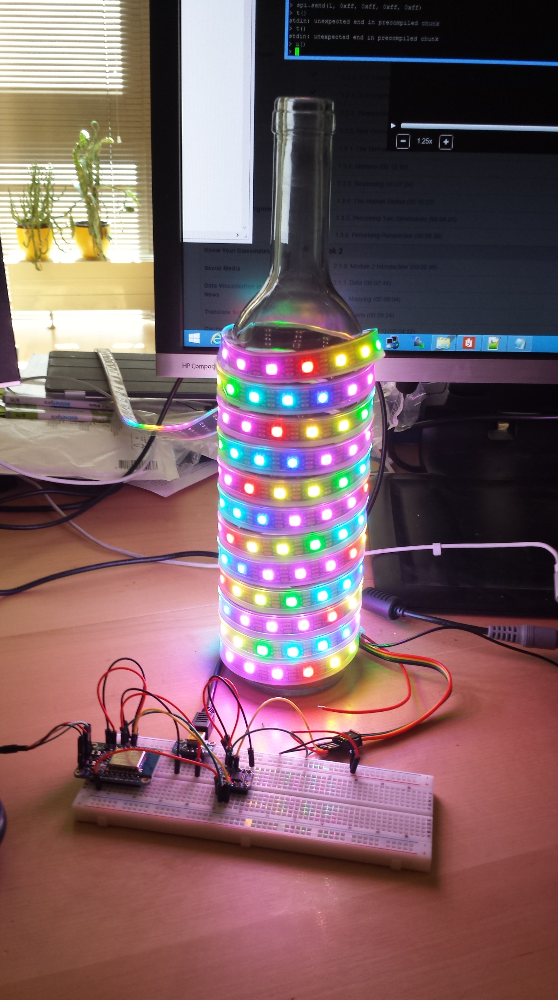

#Save-O-Meter - The Lamp

The Save-O-Meter Lamp is the main part of this visualization project. Its hardware is a microcontroller with WirelessLAN (WiFi) and the famous [Adafruit DotStar RGB-LEDs](https://learn.adafruit.com/adafruit-dotstar-leds). 

###ESP8266

Using the low-cost ESP8266 hardware everyone familiar with Arduino, C or LUA will be able to create a lamp for ~50-60 Euros.

- [ESP8266 Breadboard version](TheLamp_ESP8266_Breadboard.md)
- [ESP8266 Wired version](TheLamp_ESP8266_Wired.md)
- [ESP8266 PCB version](TheLamp_ESP8266_PCB.md) (coming soon!)
- [ESP8266 Software](TheLamp_ESP8266_Software.md)

###Netduino 3 Wi-Fi

For people who need more I/O-ports and love coding and debugging using C# and the .NET Micro Framework

- [Netduino Wired version](TheLamp_Netduino3WiFiWired)
