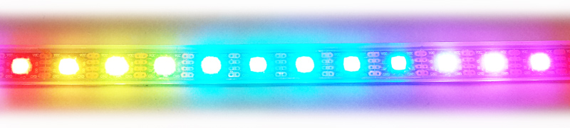

#ESP8266 Software


## Debugging the LED strip

1.) Connect via the USB2Serial adapter

2.) Init the SPI port
```lua
    spi.setup(1, spi.MASTER, spi.CPOL_LOW, spi.CPHA_LOW, spi.DATABITS_8, 0);
```

3.) Define and send the dotStar LED strip init sequence
```lua

    function initLEDs()
        spi.send(1, 0x00, 0x00, 0x00, 0x00)
    end

    initLEDs()    
    
```

4.) Repeat the following BGR sequence for every LED of the LED strip    
   The syntax is `spi.send(SPIId, global_brightness, BLUE, GREEN, RED)`   
   Be aware that the data forwarding inside the LED strip is organized as a shift register. This means the first color values sent will define the color of the first LED, the **second color values sent** will define the **color of the second LED**... an so on. But not the colors values get shifted (the first color values will not move a long the LED strip), but the internal data forwarding is like a shift register.
```lua
    spi.send(1, 0xff, 0x00, 0x00, 0xff)
```

Lazy people can write a simple LUA function to send color values to multiple LEDs at once
    
```lua

    function s(n, b, g, r, lum)

        if (lum == nil) then
            lum = 0xff
        end

        for j = 1, n, 1 do
            spi.send(1, lum, b, g, r)
        end
	
    end
    
    s(15, 0x00, 0x88, 0xff)		// 15x orange
    
```

5.) Send the dotStar LED strip finish sequence    
   The data forwarding within the LED strip introduces some delay of at least one cycle. This means: If you send 15 color values, just 14 will be visible immediately. For the last one you have to send at least one additional color value. This *last values* are also called *finish sequence* and is defined as a collection of at least four 0xff bytes. For more than 60 LEDs this sequence might need more bytes.
```lua
    spi.send(1, 0xff, 0xff, 0xff, 0xff)
```

6.) Send new colors    
    When you want to change the currently visible colors, just send a new init sequence `initLEDs()` and afterwards the new color values.
   
    
##     
    

## Send a rainbow

The following code uses a LUA function to send rainbow colors to the LED string.



```lua
function rainbow(NumberOfLEDs)

	spi.send(1, 0x00, 0x00, 0x00, 0x00)
	
	for j = 1, NumberOfLEDs/12+1, 1 do
		spi.send(1, 0xff, 0x00, 0x00, 0xff)
		spi.send(1, 0xff, 0x00, 0x7f, 0xff)
		spi.send(1, 0xff, 0x00, 0xff, 0xff)
		spi.send(1, 0xff, 0x00, 0xff, 0x7f)
		spi.send(1, 0xff, 0x00, 0xff, 0x00)
		spi.send(1, 0xff, 0x7f, 0xff, 0x00)
		spi.send(1, 0xff, 0xff, 0xff, 0x00)
		spi.send(1, 0xff, 0xff, 0x7f, 0x00)
		spi.send(1, 0xff, 0xff, 0x00, 0x00)
		spi.send(1, 0xff, 0xff, 0x00, 0x7f)
		spi.send(1, 0xff, 0xff, 0x00, 0xff)
		spi.send(1, 0xff, 0x7f, 0x00, 0xff)	
	end
	
	spi.send(1, 0xff, 0xff, 0xff, 0xff)
	
end
```

The code expects the total number of LEDs in the string as the first parameter for the function call. Therefore the syntax for calling the function for a 60 LED strip is:

```lua
rainbow(60)
```

## Simple Animations

Soon after you tested all the wonderful colors of your LED strip, you probably want to do some animations. This will need some preparation before we can start.    

First, let's define an array of color values (again in Blue-Green-Red order). Here we choose to use 10 values. As you might guess, this could look like some sort of moving light spot...

```lua
pattern = {
	0x00, 0x00, 0x00,
	0x00, 0x00, 0x00,
	0x00, 0x00, 0x00,
	0x00, 0x00, 0x00,
	0x00, 0x00, 0x00,
	0x00, 0x00, 0x00,
	0xff, 0xff, 0xff,
	0x42, 0x42, 0x42,
	0x05, 0x05, 0x05,
	0x02, 0x02, 0x02
}
```

As it is very likely, that the number of LEDs within your strip is not a multiple of the number of defined colors within the pattern, we have to extrapolate the pattern.

```lua
    function extrapolate(color3data, numberOfLEDs)

	local color_count	= #color3data
	
	if (color_count % 3 > 0) then
		print("Illegal size of input array! Must be a multiply of 3!")
		return
	end		

	local output 		= {}
	local lednum		= 0
	local pos           = 0

	while lednum < numberOfLEDs do
		table.insert(output, 0xff)
		table.insert(output, color3data[pos+1])
		table.insert(output, color3data[pos+2])
		table.insert(output, color3data[pos+3])
		pos = (pos + 3) % color_count
		lednum = lednum + 1
	end

	return output

    end
```

After we prepared the color pattern to match the number LEDs within the LED strip, we define another function to return a copy of the pattern respecting some offset value. This offset value will allow us to create the animation effect.

```lua
function shift(color4data, n)
	
	local count		= #color4data
	local output 	= {}
	local offset	= n*4
	
	for i=0, count-1 do
		output[i+1] = color4data[1 + ((i + offset) % count)]
	end
	
	return output
	
end
```

Just a little helper function to send a prepared color pattern to the LED strip.

```lua
function leds(color4data)
	spi.send(1, 0x00, 0x00, 0x00, 0x00)
	spi.send(1, color4data)
	spi.send(1, 0xff, 0xff, 0xff, 0xff, 0xff, 0xff)
end
```

In the following we use a LUA timer to schedule the animation steps. Every time the timer calls the inner function we shift all color values by one LED and send the new color pattern to the LED strip. The delay parameter can be used to control the time between two animation steps. It is measured in milliseconds.

```lua
function animate(color3data, numberOfLEDs, delayMS)

	local color_count  = #color3data
	local color4data   = extrapolate(color3data, numberOfLEDs)
	
	if delayMS == nil then
		delayMS = 100
	end

	tmr.alarm(0, delayMS, 1, function ()

		if foo == nil then
			foo = -1
		end
	
		foo = (foo + 1) % color_count

		leds(shift(color4data, foo))

	end)

	collectgarbage("collect")
	
end
```

Let's give it a try...

```lua
animate(pattern, 75, 30)
```

If you have seen enough... stop the animation via the timer object.

```lua
tmr.stop(0)
```
